# Split Fleets prototype — screenshot walkthrough

A full event run through the prototype (see
[`split-fleets-prototype.md`](split-fleets-prototype.md) for the demo setup,
findings, and shortcut list; the design lives in
`docs/design/qualifying-final-series.md` and
`docs/design/ux/flows/split-fleets.md`). Screenshots taken during the
2026-07-22 review session: 48 imported competitors, 3 qualifying fleets
(ILCA preset), four qualifying races over two rounds, a Gold/Silver/Bronze
split, two final races, and a medal race with the companion "last race" —
finish sheets entered via the CSV finish-sheet import throughout.

Where a screenshot demonstrates a design behaviour or exposed a finding,
that's noted inline — this doubles as the evidence trail for the findings
list.

## 1. Setup

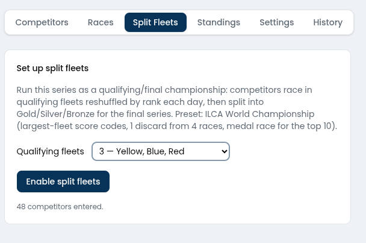

The setup card on the Split Fleets tab: preset summary in prose, one real
decision (how many qualifying fleets), and the entry count as a
preflight check. *Finding it fed:* this configuration should also appear
as a Settings card like scoring mode — visible after enablement,
read-only once locked.

## 2. Before the first assignment

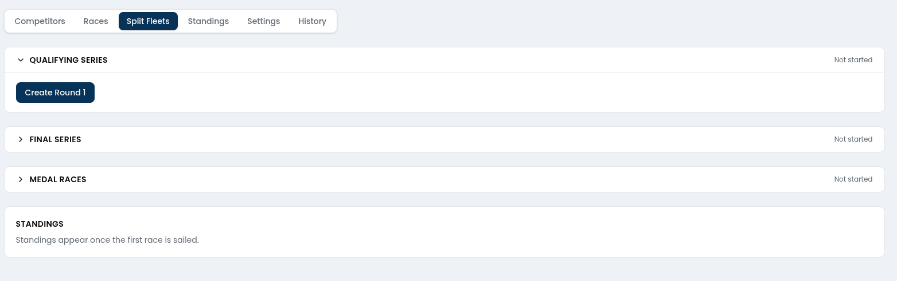

The phase stack with nothing committed: Qualifying expanded with its one
possible action, Final and Medal collapsed as "Not started", standings
placeholder below. The page is the checklist — a relief scorer can read
the event state at a glance.

## 3. Seeding Round 1

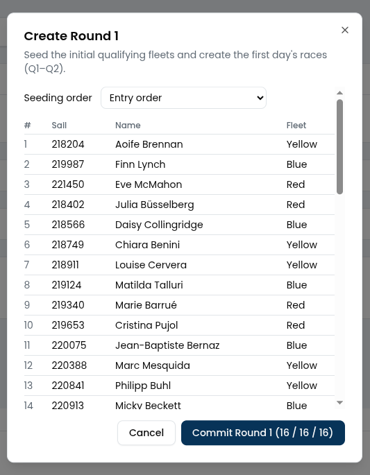

The first ceremony: seeding-order choice, full preview table (rank →
fleet per the down-and-back pattern), and a commit button that states
the outcome ("16 / 16 / 16"). Nothing happens without a preview.

## 4. Round 1 committed

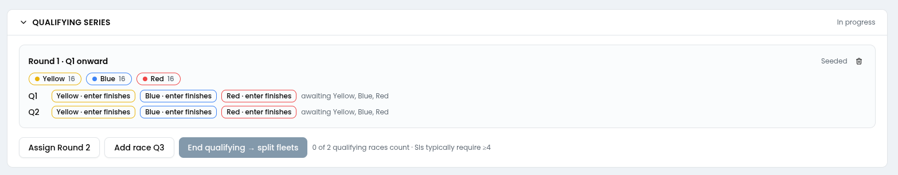

The round card: fleet chips with sizes, Q1/Q2 as slot rows — one chip
per physical race, each linking to standard finish entry — and the
validity state ("awaiting Yellow, Blue, Red"). The end-qualifying button
is present but visually muted; the caption gives facts, not judgement
("0 of 2 qualifying races count · SIs typically require ≥4") — the
advisory-never-authoritative principle.

## 5. Q1–Q2 entered

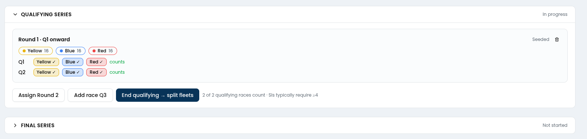

After importing all six finish sheets: every chip ticked, both logical
races flipped to green **counts**, and "End qualifying → split fleets"
now reads as the natural next action. Finish entry needed no
split-fleet-specific UI — the fleet-scoped starts did the roster
scoping.

## 6. Assigning Round 2

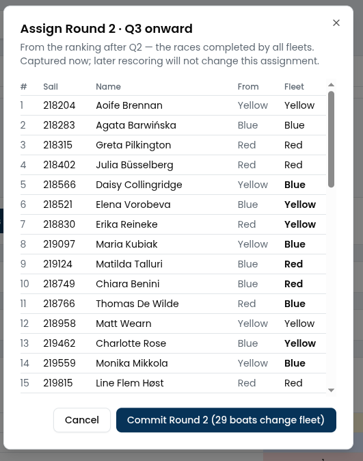

The evening ceremony. The basis is computed and stated — "From the
ranking after Q2 — the races completed by all fleets. Captured now;
later rescoring will not change this assignment" — and the preview
shows each boat's from → to with movers in bold, totalled on the commit
button ("29 boats change fleet"). This is the frozen-snapshot model made
visible.

## 7. Round 2 committed

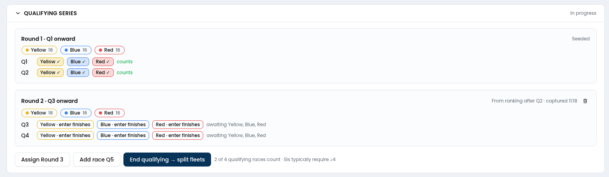

Both rounds stacked with their provenance ("Seeded" vs "From ranking
after Q2 · captured 11:18"), Q3/Q4 slots awaiting finishes, and the
delete affordance only on the newest round. *Finding this stage fed:*
Settings → Fleets now shows two bare "Yellow" rows — round fleets need
round-scoped names everywhere the raw fleet list surfaces.

## 8. Four races counting — the cut line

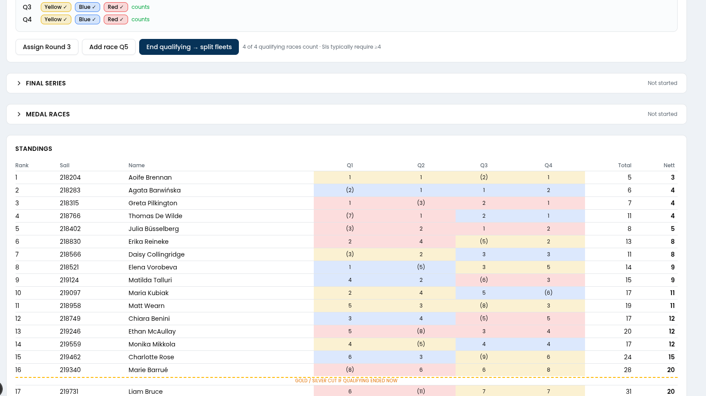

The payoff view. Combined standings over Q1–Q4: cells tinted by the
fleet the boat sailed each race in (the per-row colour changes tell the
reshuffle story at a glance), discards in parentheses once the 4-race
threshold engaged, and the dashed **"GOLD / SILVER CUT IF QUALIFYING
ENDED NOW"** line — the question every sailor asks all week, answered in
the table.

## 9. The split

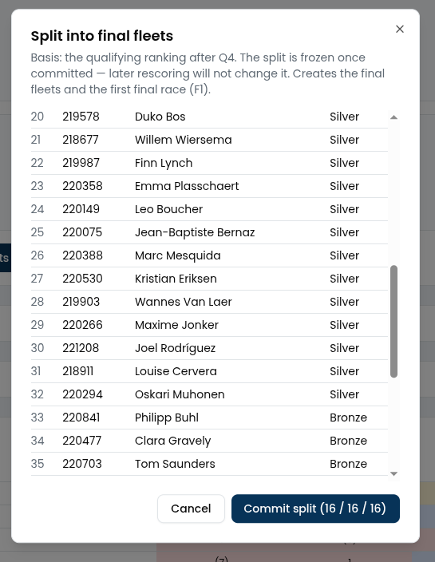

End of qualifying: the split preview scrolled to the Silver/Bronze
boundary, block assignments listed per boat, commit button carrying the
sizes ("16 / 16 / 16"). Same ceremony shape as every other assignment.

## 10. Final series begins

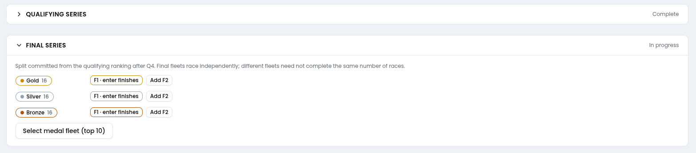

Qualifying collapses to **Complete** — the phase-status arc pays off —
and the Final section takes over: Gold/Silver/Bronze chips, F1 ready
per fleet, per-fleet "Add F2" (final fleets race independently; the
caption states the rule). Medal selection waits below.

## 11. F1–F2 complete

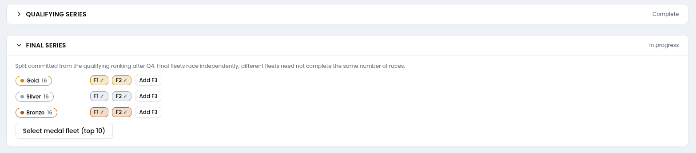

Both final races entered for all three fleets. Note the fleet-coloured
race chips reusing the same visual language as qualifying.

## 12. Medal round

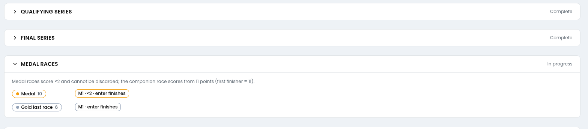

After medal selection: the 10-boat Medal fleet with its **M1 ·×2** race,
and the 6-boat "Gold last race" companion fleet, with the scoring rule
stated in the caption ("the companion race scores from 11 points").
*Findings this stage fed:* the selection itself was a bare
`window.confirm()` — it needs the full ceremony dialog, with the fleet
size scorer-editable.

## 13. Final standings

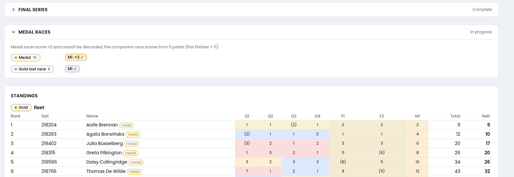

The finished event: tiered tables (Gold shown), medal boats badged, the
M1 column carrying doubled points (the winner's 2), Q-columns still
telling each boat's qualifying journey in colour. 218204 wins the
championship on 9 nett. *Findings visible here:* Medal still reads
"In progress" with nothing left to do — the event needs an ending, and
that ending should carry publish + Mark-as-final.

## 14. The history tab knew everything

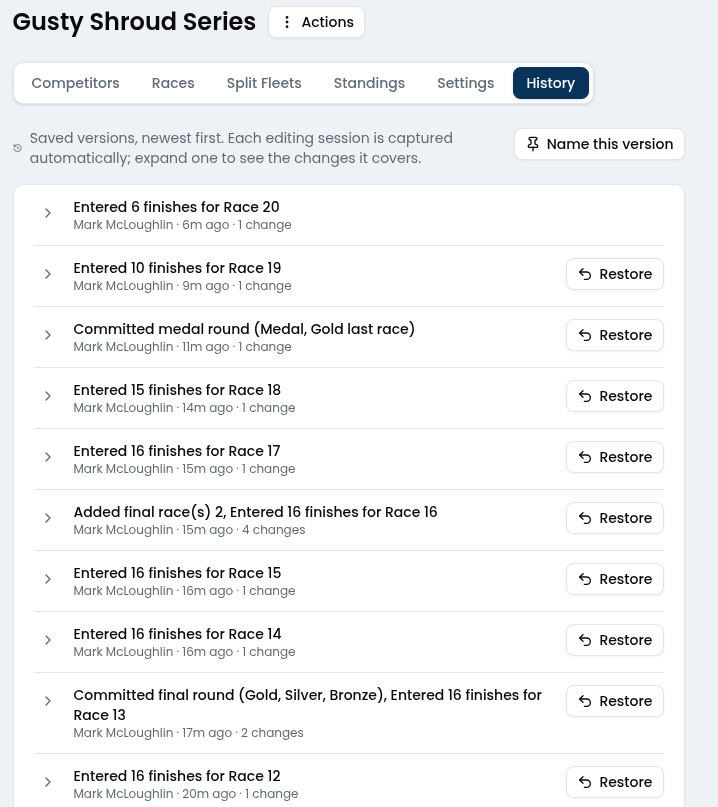

Unplanned validation: every ceremony and every imported sheet landed in
revision history automatically — "Committed final round (Gold, Silver,
Bronze)", "Committed medal round (Medal, Gold last race)", each with a
Restore button. The safety story the design promised (revisions replace
Sailwave's ritual file copies) worked without any split-fleets-specific
code. Also visible: races surfacing as "Race 12"–"Race 20" — the
raceNumber-vs-stage-identity finding.
